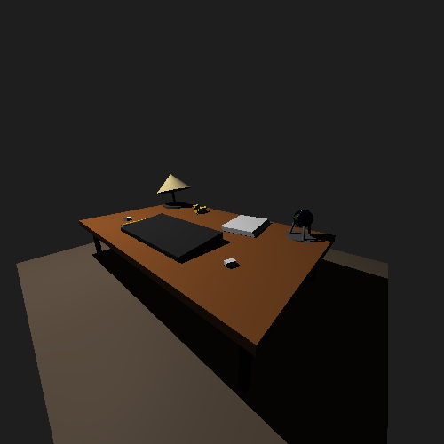

# Computer Graphics Ray Tracer

<p align="center">
  
</p>

A C++17 computer graphics project created for a Computer Graphics course at UFC. It implements its own ray-based offline renderer and an interactive preview of the same scene. Raylib is used for the preview window, input, and presentation layer; it does not perform the ray tracing calculations.

## Features

- Offline rendering to a PPM image.
- Interactive Raylib preview with free-flight camera and object picking/selection.
- Perspective, orthographic, and oblique camera projections, plus one-, two-, and three-point perspective presets.
- Point, directional, spotlight, and ambient lights with shadows.
- Ambient, diffuse, and specular material terms.
- Spheres, boxes, cylinders, cones, and triangular OBJ meshes.
- OBJ position/face loading, including fan triangulation for polygonal faces.
- PPM texture sampling.
- Object transforms and inverse-transpose normal transforms.

## How it works

For each pixel, the camera generates a ray and the renderer selects the closest valid intersection among the scene objects. Intersections are evaluated in object space and transformed back to world space. Surface normals use the inverse-transpose transform, then ambient, diffuse, and specular terms are evaluated with the selected light. Shadow rays test whether a light is occluded.

Meshes are loaded from OBJ files with vertex positions and faces. Polygonal faces are converted to triangles by fan triangulation. The loader reports malformed assets with their path and, when applicable, line number.

## Run modes

### Offline renderer

The offline program renders the scene to `saida.ppm` in the repository root.

```bash
bash ./rodar
./app.exe
```

### Interactive preview

The interactive program opens a Raylib window with the scene preview.

```bash
bash ./rodar
./app_interativo.exe
```

Run these commands from the repository root. The scene uses relative paths for `models/` assets.

## Interactive controls

| Input | Action |
| --- | --- |
| `W` / `S` | Move camera forward / backward |
| `A` / `D` | Move camera left / right |
| `E` / `Q` | Move camera up / down |
| `Left Shift` | Increase movement speed |
| Hold right mouse button | Mouse look |
| Mouse wheel | Zoom camera window |
| Left mouse button | Pick or clear the selected object |
| `Esc` | Toggle cursor capture |
| `Tab` | Hide or restore the HUD |
| `1` / `2` / `3` | Perspective / orthographic / oblique projection |
| `Z` / `X` | Cabinet / cavalier oblique projection |
| `F1` / `F2` / `F3` | One-, two-, and three-point perspective presets |
| `L` | Cycle point, directional, and spot lights |
| `[` / `]` | Decrease / increase spot cutoff while the spot is active |
| `C` | Clear selection |
| Window close button | Exit |

## Requirements

The project has been validated on Windows using Git Bash, GCC/G++, and C++17. `rodar` rebuilds the vendored Raylib sources and links the interactive executable against the Windows system libraries `opengl32`, `gdi32`, `winmm`, `ole32`, `user32`, and `shell32`.

## Tests

Build and run each test from the repository root:

```bash
g++ -std=c++17 -O2 -Wall -Wextra -Wpedantic -Isrc/utils -Isrc/objetos tests/primitives_regression.cpp -o tests/primitives_regression.exe
./tests/primitives_regression.exe

g++ -std=c++17 -O2 -Wall -Wextra -Wpedantic -Isrc/utils -Isrc/objetos tests/mesh_lighting_regression.cpp -o tests/mesh_lighting_regression.exe
./tests/mesh_lighting_regression.exe

g++ -std=c++17 -O2 -Wall -Wextra -Wpedantic -Isrc/utils -Isrc/objetos tests/obj_loading_regression.cpp -o tests/obj_loading_regression.exe
./tests/obj_loading_regression.exe
```

The generated executables are ignored by Git.

## Repository structure

```text
src/main.cpp              Offline renderer
src/main_interativo.cpp   Interactive Raylib application
src/objetos/              Primitive geometry
src/utils/                Math, camera, lighting, OBJ, texture, and transform utilities
models/                   OBJ models and PPM texture assets
tests/                    Regression tests
external/raylib/          Vendored Raylib source
rodar                     Windows/Git Bash build script
```

## Project history

This project was developed individually by Edileudo Maciel as an academic Computer Graphics assignment at the Federal University of Ceará (UFC). It was subsequently reviewed, corrected, tested, and prepared for portfolio presentation by the same author.

## Dependencies and asset credits

- Code and scene: Edileudo Maciel.
- Duck model (`models/patinho.obj`): created by Edileudo Maciel.
- Notebook model (`models/notebook.obj`): created by Edileudo Maciel.
- Earth texture (`models/earth_blue_marble_nasa.ppm`): converted without artistic changes from NASA's [Blue Marble: Next Generation base map](https://science.nasa.gov/earth/earth-observatory/blue-marble-next-generation/base-map/), using the official [January 5400×2700 JPEG](https://assets.science.nasa.gov/content/dam/science/esd/eo/images/bmng/bmng-base/january/world.200401.3x5400x2700.jpg).
- NASA imagery is used under NASA's [Images and Media Usage Guidelines](https://www.nasa.gov/nasa-brand-center/images-and-media/). NASA does not endorse this project.
- Raylib 5.5 is vendored in `external/raylib/`; its unmodified [license](external/raylib/LICENSE) is included with this repository. GLFW is included as part of its desktop backend source tree.

The NASA source page does not identify third-party copyright for the selected base map, and the downloaded image contains no NASA logo.

## Limitations

The current renderer does not implement a BVH acceleration structure, reflections, refractions, or anti-aliasing. Rendering is therefore intended for small educational scenes rather than high-performance production workloads.
